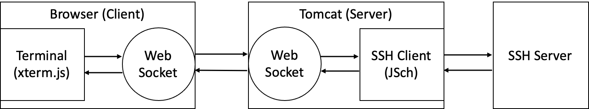

# Web Browser Terminal

## 1. External Library

### 1-1. Front-End (Browser-side)

1. [xterm.js](https://xtermjs.org/) for terminal UI.
2. [JSEncrypt](https://github.com/travist/jsencrypt) for RSA Encryption.
3. [CryptoJS](https://cryptojs.gitbook.io/docs/) for AES Encryption.
4. [JQuery](https://jquery.com/).
5. [Bootstrap4](https://getbootstrap.com/) for UI.

### 1-2. Back-End (Server-side)

1. [tomcat 9.0](http://tomcat.apache.org/) is used for both Web and WebSocket Server.
2. [JSch](http://www.jcraft.com/jsch/) is used for java side SSH client.
3. [Gson](https://github.com/google/gson) is used for parsing json.

## 2. Overview

1. (browser-client) **WebSocket:** create a websocket and send a `Connection` message.
2. (tomcat-server) **WebSocket:** recevie the `Connection` message.
3. (tomcat-server) **JSch:** try connection to ssh server with information of `Connection` message.
4. (tomcat-server) (When Success,) bind **JSch** I/O and **WebSocket** I/O.
5. (tomcat-server) **WebSocket:** send result of connection.
6. (browser-client) **WebSocket:** receive result of connection. (if error, stop and disconnect websocket)
7. (browser-client) bind **Terminal(xterm.js)** I/O and **WebSocket** I/O.

### WebSocket Message Format 

Client and server are communicate through **WebSocket** over _JsonRPC-like_ message.
[See here](MessageFormat.md) for more specific information.

### Secure Message Transfer

**Web Browser Terminal** supports _Secure Message Transfer_ between websockets of client and server. **Web Browser Terminal** checks your browser protocol is which _http_ or _https_. If browser protocol is _http_, then **Web Browser Terminal** will use _Secure Message Transfer_ automatically.

1. **Web Browser Terminal** requests a RSA public key to server.
2. On `Connection` message, A _Secret Key_ will be included. After connection has been established, all of `Data` messages will be encrypted with the _Secret Key_.
3. Send `Connection` message with encryption through the RSA public key.

